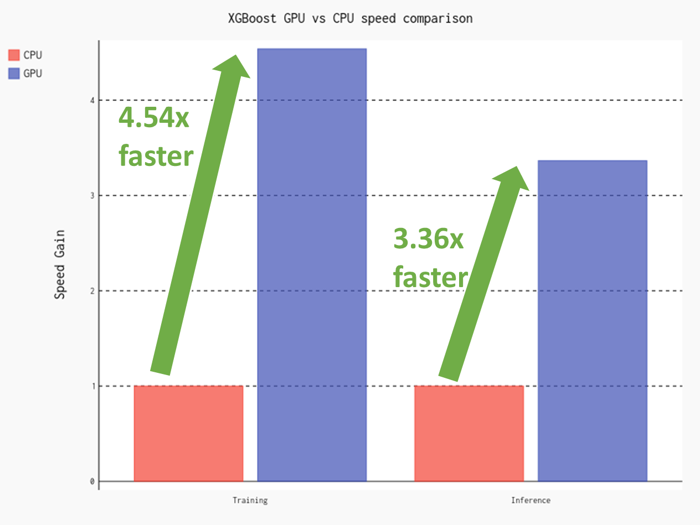

# Accelerating XGBoost with GPU

This repository demonstrates how to accelerates XGBoost with GPU. The code to run XGBoost with GPU can be found in [xgb_gpu.ipynb](xgb_gpu.ipynb) notebook. You can compare this code with the code to run XGBoost without GPU that can be found in [xgb_cpu.ipynb](xgb_cpu.ipynb) notebook. Below is the result of XGBoost GPU vs. CPU speed benchmarking. XGBoost with GPU is 4.54 times faster for training and 3.36 times faster for inference.



## Installation

To install necessary libraries for running the notebooks in this repository, run the following command:

```bash
pip install -r requirements.txt
```

## Dataset

The code in this repository is applied to credit card fraud detection dataset obtained from this Kaggle [dataset](https://www.kaggle.com/datasets/rupakroy/online-payments-fraud-detection-dataset). To run the code in this repository, download `PS_20174392719_1491204439457_log.csv` from the provided dataset link and place it in the same folder as the code.
